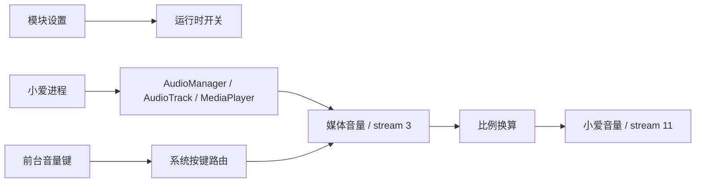

# XiaoAi Volume Sync

> 让 HyperOS 小爱同学使用媒体音量。

[](https://developer.android.com/about/versions/12)
[](https://github.com/LSPosed/LSPosed)
[](https://github.com/Rin010/xiaoai-volume-sync)

在无数次骑车需要单独调小爱音量，又无数次晚上让关灯被最大音量背刺后搞了这玩意。此项目除了这段话都是AI搞的，有问题找AI。

XiaoAi Volume Sync 是一个适用 HyperOS 的 LSPosed 模块，用于控制小爱同学独立音量流的行为。它可以让小爱音量跟随媒体音量，或让小爱的播报直接使用媒体音量。

模块仅作用于小爱同学（`com.miui.voiceassist`）和 Android 系统框架，不需要网络权限。

## 功能

| 功能 | 说明 | 默认值 |
| --- | --- | :---: |
| 小爱音量同步媒体音量 | 按最大档位比例，将媒体音量单向同步到小爱独立音量 | 开 |
| 小爱同学使用媒体音量 | 将小爱对助手音量的读取和播报重定向到媒体音量 | 关 |
| 小爱同学前台按键修改媒体音量 | 小爱界面或浮窗位于前台时，让音量键调节媒体音量 | 开 |
| 禁用小爱同学静音媒体音量 | 阻止小爱在语音识别期间临时静音媒体及随后恢复静音状态 | 开 |

可在模块设置页随时修改。“使用媒体音量”需要重启小爱进程以重建播放器，其余开关会立即应用。

## 环境要求

- 已取得 Root 权限的 HyperOS 设备
- 已安装并正常运行 [LSPosed](https://github.com/LSPosed/LSPosed)
- Android 12 / API 31 或更高版本
- 小爱同学包名为 `com.miui.voiceassist`
- Xposed API 82 或更高版本

## 安装

1. 从源码[构建 APK](#从源码构建)，然后安装：

   ```shell
   adb install -r XiaoAiVolumeSync-1.4.0.apk
   ```

2. 在 LSPosed 中启用 **小爱音量跟随**。
3. 将模块作用域设置为：
   - **超级小爱 / 小爱同学**（`com.miui.voiceassist`）
   - **系统框架**（`android`）
4. 重启设备，并在开机后解锁一次。
5. 启动一次小爱同学，打开模块设置页，点击 **刷新运行状态**。

设置页同时显示小爱进程、播放流、AudioTrack 用途和系统按键路由状态。只安装 APK 而未在 LSPosed 中启用作用域，模块不会生效。

### 卸载

先在 LSPosed 中禁用模块，再重启设备并卸载 APK。模块不会在禁用时改写现有的媒体或小爱音量档位。

## 推荐配置

| 使用方式 | 同步 | 使用媒体音量 | 前台按键 | 禁止媒体静音 |
| --- | :---: | :---: | :---: | :---: |
| 仅让两个音量保持接近 | 开 | 关 | 开 | 关 |
| 完全使用媒体音量 | 关 | 开 | 关(此时调整音量自动为媒体音量) | 关 |
| 保留独立小爱音量 | 关 | 关 | 关 | 按需 |

“同步”和“使用媒体音量”可以同时开启。此时小爱的实际播报使用媒体音量，独立小爱滑块仍会跟随媒体音量。

如果开启同步、关闭前台按键转发并继续使用独立小爱音量，音量键对小爱音量的修改可能很快被同步逻辑恢复。需要在小爱前台使用音量键时，建议保持前台按键转发开启。

## 工作原理

HyperOS 为小爱同学使用独立的助手音量流（stream 11），普通媒体使用 `STREAM_MUSIC`（stream 3）。模块在两个进程中分别处理音量与按键：



### 音量同步

同步采用最大档位比例换算，而非直接复制数值。例如设备的媒体音量范围为 0–150、小爱音量范围为 0–15 时，媒体音量 80 会映射为小爱音量 8。媒体静音对应小爱静音；媒体非零时，小爱至少保持 1 档。

### 直接使用媒体音量

模块在小爱进程内 Hook 稳定的 Android 框架 API：

- 将针对 stream 11 的 `AudioManager` 音量读取重定向到 stream 3。
- 将小爱创建的 `AudioTrack` 和 `MediaPlayer` 从 `USAGE_ASSISTANT` 改为 `USAGE_MEDIA`。
- 保留小爱的音频焦点请求，不改变其他应用的音频行为。

### 前台音量键

系统进程中的按键路由仅在小爱 Activity 或 `voice_assist_root` 浮窗处于前台时启用。前台状态会校验上报进程的 PID 和 UID，避免小爱被强制停止后残留错误状态。

### 媒体静音拦截

小爱的媒体静音和自动音量方法属于私有实现。模块按完整方法签名探测已知实现；未找到兼容方法时会跳过对应拦截，不影响框架层的音量读取和播放重定向。

## 兼容性

当前版本已在以下设备上完成实机验证：

| 设备型号 | 代号 | Android / HyperOS | 小爱同学 | 结果 |
| --- | --- | --- | --- | :---: |
| M2105K81AC | `elish` | Android 16 / OS3.0.6.0.WNXCNXM | 7.13.33.0017 | 通过 |
| 23116PN5BC | `shennong` | Android 16 / OS3.0.306.0.WNBCNXM | 7.13.21.0017 | 通过 |

最低系统版本仅表示 APK 可以安装，不代表所有 HyperOS 和小爱版本都已验证。详细测试记录位于 [`verification/`](verification/)。

从 1.3.0 起，核心重定向不再依赖小爱内部经常变化的混淆类名，而是使用 `AudioManager`、`AudioTrack` 和 `MediaPlayer`。小爱升级后，建议在模块状态页确认：

- **播放选择**为流 3（媒体）
- **最近 AudioTrack** 为流 3、用途 1
- **前台音量键转发**显示当前模块版本且已启用

蓝牙、耳机、免打扰和不同对话模式可能使用不同的设备音频策略，欢迎提交对应设备的测试结果。

## 从源码构建

构建脚本面向 Windows PowerShell，不依赖 Android Studio 或 Gradle。

### 依赖

- JDK，包含 `java`、`javac`、`jar` 和 `keytool`
- Android SDK Platform 36
- Android SDK Build Tools 36
- [Xposed API 82](https://api.xposed.info/de/robv/android/xposed/api/82/api-82.jar)

已验证的依赖文件：

| 依赖 | 下载 | 校验值 |
| --- | --- | --- |
| Android Platform 36 rev. 2 | [platform-36_r02.zip](https://dl.google.com/android/repository/platform-36_r02.zip) | SHA-1 `2c1a80dd4d9f7d0e6dd336ec603d9b5c55a6f576` |
| Android Build Tools 36 | [build-tools_r36_windows.zip](https://dl.google.com/android/repository/build-tools_r36_windows.zip) | SHA-1 `f16ccffd34de8790dede813a6c7d8e2c11a27b50` |
| Xposed API 82 | [api-82.jar](https://api.xposed.info/de/robv/android/xposed/api/82/api-82.jar) | SHA-256 `f48c635f1c7469fdec0e00ad2ea0b7a6b2f5b55065784a35b7ca3a84615e8e25` |

### 构建命令

```powershell
./build.ps1 `
  -JavaHome 'C:/path/to/jdk' `
  -SdkPath 'C:/path/to/android-sdk' `
  -XposedApiJar 'C:/path/to/api-82.jar' `
  -WorkDir 'C:/path/to/build-release' `
  -OutputApk 'C:/path/to/XiaoAiVolumeSync-1.4.0.apk'
```

脚本会依次执行音量换算与按键规则测试、资源编译、DEX 构建、ZIP 对齐和 APK v3 签名验证，并在结束时输出 APK 的 SHA-256。

首次构建会在 `WorkDir` 的父目录创建 `xiaoaivolumesync-signing.p12`。该证书只用于本地测试签名，固定密码 `local-build-key` 不提供安全保护。请勿将证书提交到仓库或用于正式分发签名。

### 诊断构建

```powershell
./build.ps1 `
  -JavaHome 'C:/path/to/jdk' `
  -SdkPath 'C:/path/to/android-sdk' `
  -XposedApiJar 'C:/path/to/api-82.jar' `
  -WorkDir 'C:/path/to/build-diagnostics' `
  -OutputApk 'C:/path/to/XiaoAiVolumeSync-diagnostics.apk' `
  -Diagnostics
```

诊断版会额外注册需要 `DUMP` 权限的自检广播。正式构建不包含这些广播；两种构建应使用不同的 `WorkDir`。

## 项目结构

```text
app/src/main/
├── AndroidManifest.xml
├── assets/xposed_init
├── java/io/github/rin/xiaoaivolumesync/
│   ├── DirectMediaHooks.java   # 媒体音量读取与播放重定向
│   ├── HookEntry.java          # Xposed 入口
│   ├── MainActivity.java       # 设置和运行状态页面
│   ├── SyncController.java     # 音量同步
│   └── SystemKeyRouter.java    # 系统音量键路由
└── res/
tests/                          # 独立 JVM 测试
verification/                   # 实机验证记录
build.ps1                       # 可复现构建脚本
```

## 故障排查

### 设置页未收到小爱进程回报

确认 LSPosed 已启用模块，并同时勾选小爱同学和系统框架。重启设备、完成首次解锁，再启动一次小爱同学。

### “使用媒体音量”已开启但播报仍使用小爱音量

强制停止并重新启动小爱同学，使缓存的播放器重新创建。随后刷新模块状态，检查播放选择和最近 AudioTrack 是否为媒体流。

### 小爱前台的音量键仍在修改独立音量

检查系统框架是否在作用域中，并确认设备在启用模块后已重启。设置页中的“前台音量键转发”应显示当前版本且已启用。

### 小爱升级后部分功能失效

先确认框架层的媒体音量重定向是否仍然生效。私有的静音与自动音量方法可能随小爱版本变化；提交 Issue 时请附上设备型号、HyperOS 版本、小爱版本以及以下日志：

```shell
adb logcat -s XiaoAiVolumeSync
```

日志仅记录模块状态、音量流和数值，不记录语音内容。

## 隐私与安全

- APK 不申请网络权限。
- 模块不采集或上传任何数据。
- 运行日志不包含语音内容。
- 状态 Provider 和进程间广播会校验签名、UID 或进程身份。
- 正式版不注册诊断广播。

## 相关项目与资料

- [LSPosed](https://github.com/LSPosed/LSPosed)
- [Xposed API](https://api.xposed.info/)
- [AOSP AudioAttributes](https://cs.android.com/android/platform/superproject/+/android16-release:frameworks/base/media/java/android/media/AudioAttributes.java)
- [AOSP AudioService](https://cs.android.com/android/platform/superproject/+/android16-release:frameworks/base/services/core/java/com/android/server/audio/AudioService.java)
